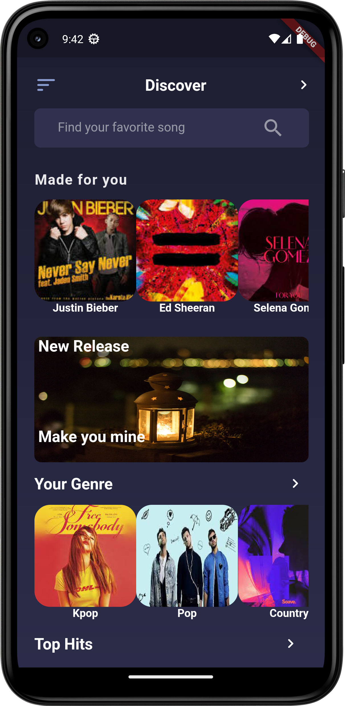
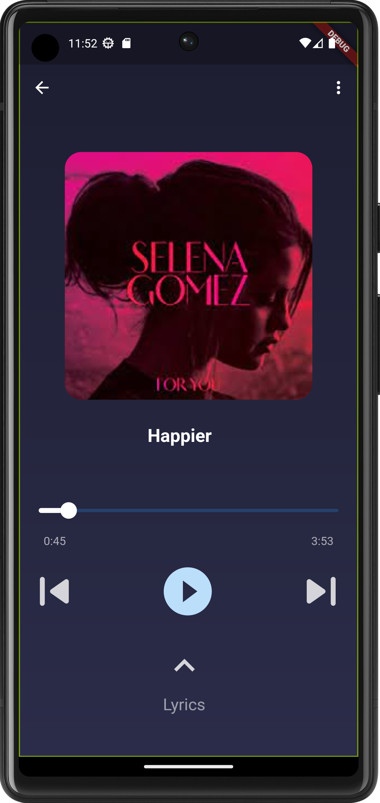

# TuneWave

**TuneWave** is a music mobile application built with Flutter and Dart, designed to offer users a rich and engaging music streaming experience. With an elegant and intuitive interface, users can explore, search, and enjoy a vast library of music tracks on their mobile devices.

## Table of Contents

- [Features](#features)
- [Screenshots](#screenshots)
- [Installation](#installation)
- [Usage](#usage)
- [Contributing](#contributing)
- [License](#license)
- [Contact](#contact)

## Features

- **Music Library:** Access a wide range of music tracks across various genres.
- **Search Functionality:** Quickly find your favorite songs and artists.
- **User Authentication:** Secure login and registration for personalized experiences(under developement).
- **Playlists:** Create and manage your own playlists.
- **Music Player:** Enjoy seamless music playback with advanced controls(under developement).
- **Favorites:** Mark songs as favorites for easy access(under developement).
- **Offline Mode:** Download songs to listen offline.

## Screenshots




## Usage

- **Browse the music library and explore different genres.**
- **Search for specific songs or artists using the search bar.**
- **Play your favorite tracks with the built-in music player.**
- **Create and manage playlists to organize your music.**
- **Download songs for offline listening.**
- **Mark songs as favorites for quick access.**


## Installation

To get a local copy up and running, follow these simple steps:

### Prerequisites

- [Flutter](https://flutter.dev/docs/get-started/install) - Ensure Flutter is installed on your machine.
- Dart - Dart comes with Flutter.

### Clone the repository

```bash
git clone https://github.com/yourusername/TuneWave.git
cd TuneWave
flutter pub get
flutter run
```

## License

- **Distributed under the MIT License. See LICENSE for more information.**